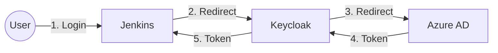

# Identity Brokering: Jenkins -> Keycloak -> Azure AD

This guide explains how to configure your current setup to use **Azure Active Directory (Microsoft Entra ID)** as the ultimate source of truth for user identities, while keeping **Keycloak** as the authentication broker for Jenkins.

This architecture allows Jenkins to talk *only* to Keycloak (standard OIDC), while Keycloak handles the complexity of federating with Azure AD.

## Architecture

## Prerequisites

1.  **Azure AD Tenant:** You need access to an Azure AD tenant with permissions to register applications.
2.  **Keycloak Admin Access:** You must be able to log in to the Keycloak Administration Console (`https://jenkins.lab.local:8444/`).

---

## Step 1: Register Keycloak in Azure AD

1.  Log in to the [Azure Portal](https://portal.azure.com).
2.  Navigate to **Microsoft Entra ID** (formerly Azure Active Directory).
3.  Go to **App registrations** -> **New registration**.
4.  **Register an application:**
    *   **Name:** `Jenkins Keycloak Broker`
    *   **Supported account types:** "Accounts in this organizational directory only" (Single tenant) or Multitenant as needed.
    *   **Redirect URI (Web):**
        *   Format: `https://<YOUR_KEYCLOAK_DOMAIN>/realms/<YOUR_REALM>/broker/oidc/endpoint`
        *   For this lab: `https://jenkins.lab.local:8444/realms/jenkins-lab/broker/oidc/endpoint`
    *   Click **Register**.
5.  **Copy Application Details:**
    *   **Application (client) ID**
    *   **Directory (tenant) ID**
6.  **Create a Client Secret:**
    *   Go to **Certificates & secrets** -> **New client secret**.
    *   Copy the **Value** immediately.

---

## Step 2: Configure Azure AD as an Identity Provider in Keycloak

1.  Log in to Keycloak Admin Console (`https://jenkins.lab.local:8444/`).
2.  Select the `jenkins-lab` realm (top-left dropdown).
3.  Go to **Identity Providers** (left menu).
4.  Click **Add provider...** and select **OpenID Connect v1.0** (or "Microsoft" if available, but OIDC is standard).
5.  **Configure the Provider:**
    *   **Alias:** `azure-ad`
    *   **Display Name:** `Login with Azure AD`
    *   **Authorization URL:** `https://login.microsoftonline.com/<YOUR_TENANT_ID>/oauth2/v2.0/authorize`
    *   **Token URL:** `https://login.microsoftonline.com/<YOUR_TENANT_ID>/oauth2/v2.0/token`
    *   **Client ID:** Paste the **Application (client) ID** from Azure.
    *   **Client Secret:** Paste the **Client Secret Value** from Azure.
    *   **Issuer:** `https://login.microsoftonline.com/<YOUR_TENANT_ID>/v2.0`
    *   **Default Scopes:** `openid profile email`
    *   **Validate Signature:** On (usually requires importing Azure's keys or setting JWKS URL).
        *   **JWKS URL:** `https://login.microsoftonline.com/<YOUR_TENANT_ID>/discovery/v2.0/keys`
6.  Click **Save**.

---

## Step 3: Map Azure AD Groups/Roles (Optional)

To map Azure AD groups to Keycloak roles (and thus Jenkins permissions):

1.  **In Keycloak:** Go to the **Identity Providers** -> `azure-ad` -> **Mappers**.
2.  **Add Mapper:**
    *   **Name:** `groups-mapper`
    *   **Sync Mode:** `Import`
    *   **Mapper Type:** `Claim to Role` or `Advanced Claim to Group`.
    *   **Claim:** `groups` (You need to ensure Azure AD sends group claims in the token).

*Note: Azure AD group claims often send UUIDs, not names. You may need to map specific Group UUIDs to the `jenkins-admins` role in Keycloak.*

---

## Step 4: Test the Flow

1.  Open a private browser window.
2.  Navigate to Jenkins: `https://jenkins.lab.local:8443/`.
3.  Click **Login**.
4.  You will be redirected to the Keycloak Login Page.
5.  **Crucial Step:** Instead of logging in with the `admin` user, click the new **"Login with Azure AD"** button.
6.  Authenticate with your Microsoft credentials.
7.  If successful, Keycloak will create a local user in the `jenkins-lab` realm linked to your Azure AD account and redirect you back to Jenkins logged in.

## Troubleshooting

*   **Redirect URI Mismatch:** Ensure the URI in Azure App Registration exactly matches what Keycloak expects (`.../broker/oidc/endpoint`).
*   **"Issuer" Mismatch:** If Keycloak logs show an issuer error, ensure the `Issuer` field in Keycloak config matches exactly what Azure sends in the token (usually includes the Tenant ID).
